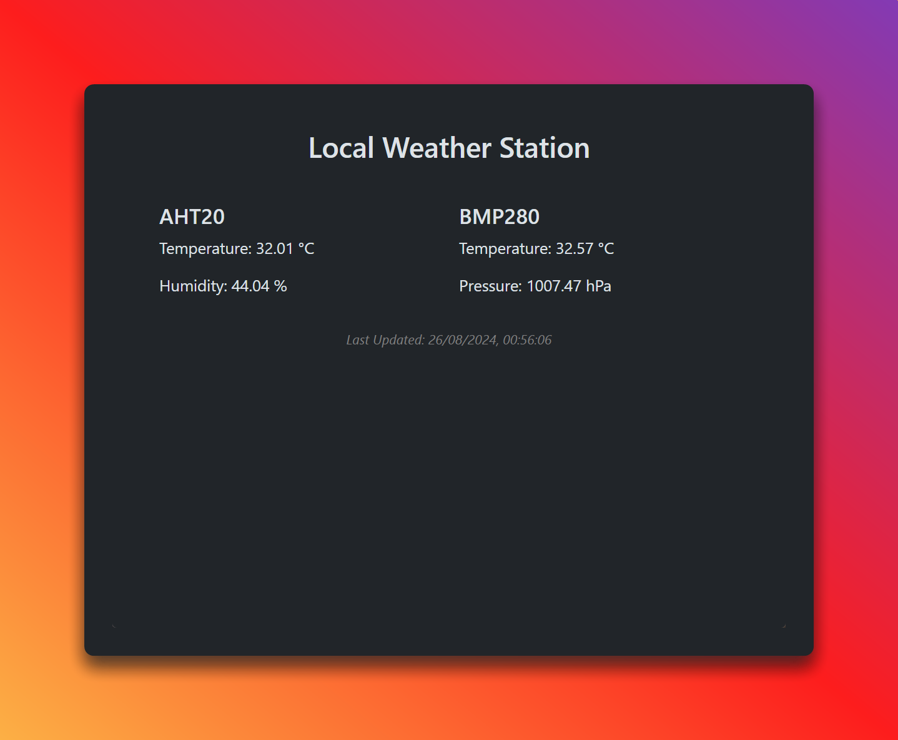

# Arduino Local Weather Station 🌤️



[](https://github.com/EXELVI/Arduino_Local_Weather_Station/commits/main/)
[](https://github.com/EXELVI/Arduino_Local_Weather_Station)
[](https://github.com/EXELVI/Arduino_Local_Weather_Station/issues)
[](https://github.com/EXELVI/Arduino_Local_Weather_Station/network/members)
[](https://github.com/EXELVI/Arduino_Local_Weather_Station/stargazers)


[](https://www.arduino.cc/)
[](https://www.arduino.cc/en/Reference/WiFi)
[](https://www.aliexpress.com/item/1005005982427374.html)

## 👀 Overview

The **Arduino Local Weather Station** is a project that combines Arduino, Wi-Fi connectivity, and sensor data to create a local web server displaying real-time weather information. It uses the AHT20 sensor to measure temperature and humidity, and the BMP280 sensor to measure atmospheric pressure and temperature. The data is hosted on a local web server that you can access from any device connected to the same network.

## ✨ Features

- 🌡️ **Temperature Measurement**: Captures ambient temperature using AHT20 and BMP280 sensors.
- 💧 **Humidity Measurement**: Measures relative humidity with the AHT20 sensor.
- 🌪️ **Pressure Measurement**: Provides atmospheric pressure readings using the BMP280 sensor.
- 🌍 **Real-Time Clock (RTC)**: Synchronizes with an NTP server to keep track of the current time.
- 📡 **Wi-Fi Connectivity**: Hosts a local web server to display weather data.
- 🖥️ **Responsive Web Interface**: Uses Bootstrap for a clean, responsive user interface.

## ⚙️ Hardware Requirements

- **Arduino UNO R4 WIFI**: Since the project uses WiFiS3 and the internal RTC.
- **AHT20 Sensor + BMP280 Sensor**: For temperature, humidity, and pressure measurements.
- **Jumpers wires**: To connect the sensors to the Arduino board.

## 🚀 Getting Started

### 🔌 Hardware Setup

1. **Connect Sensors**:
    - **AHT20 + BMP280**: Connect the sensors to the Arduino board using the I2C interface. (SCL to SCL, SDA to SDA, VCC to 3.3V, GND to GND)

2. **Power Up**: Ensure your Arduino board is powered up and connected to your computer via USB. 

### 📦 Software Setup

1. **Clone this repository**:
    ```bash
    git clone https://github.com/EXELVI/Arduino_Local_Weather_Station.git
    cd Arduino_Local_Weather_Station
    ```

2. **Install Required Libraries**:
    Ensure the following libraries are installed in your Arduino IDE:
    - `NTPClient`
    - `WiFiS3` or your board's Wi-Fi library
    - `Arduino_JSON`
    - `Adafruit AHTX0`
    - `Adafruit BMP280`
    - `RTC`

3. **Configure Wi-Fi Credentials**:
    Edit the `arduino_secrets.h` file with your Wi-Fi credentials:
    ```cpp
    #define SECRET_SSID "your-SSID"
    #define SECRET_PASS "your-PASSWORD"
    ```

4. **Upload the Code**:
    Upload the provided code to your Arduino board via the Arduino IDE.

5. **Access the Web Server**:
    Once the board is connected to Wi-Fi, access the local weather station by navigating to the IP address displayed in the Serial Monitor.

## ❓ How It Works

After successful setup, the local weather station will:
- Continuously read data from the AHT20 and BMP280 sensors.
- Host a web page that automatically refreshes data every 10 seconds to display the latest sensor data.
- Show the last update time based on the synchronized RTC.

## 🤝 Contributions

Contributions, issues, and feature requests are welcome! Feel free to check the [issues page](https://github.com/EXELVI/Arduino_Local_Weather_Station/issues) for existing issues or submit a new one.

---

<div align="center">
    <sub>Made with ❤️ by <a href="https://github.com/EXELVI">EXELVI</a></sub>
</div>